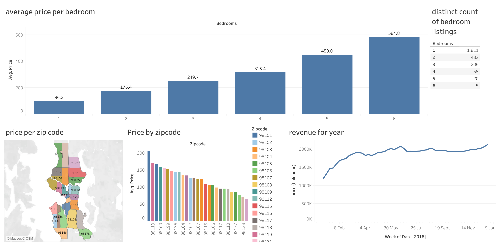

#  *Welcome to Genesis Kiah's homepage. I'm a data analysis and data visualisation specialist.*
 Hi, my name is Genesis one interesting fact about me is the meaning of my name, it means the beginning, origin or mode of formation of something! 

I began my self taught journey into data analytics in july 2022, since then I have taken two courses. The introduction into data and SQL with code first girls and google data analytic course. I have also gone on to create various visualizations alongside this work. I am skilled for data-science steps data pre-processing, application of statistical methods, data visualization and results communication.

# [project 1: company database](https://github.com/Genesiskiah/company-)

This is the dataset I created whilst undertaking the introduction to data and SQL course with code first girls. I created a database for a recruitment company which contains information focusing on the recruitment sector of the business. It was made to see how much interviews are being conducted by team members who are on a mixture of temporary and permanent contracts to see if the business targets are being met. 

* In this dataset i created a company database 
* I input information about the company database 
* I used functions such as joins, stored procedures and views to answer business questions 

## Data visualisation 
 

In this visualisation I used the **'Interviews complete vs interview targets'** bar chart to showcase which team members were reaching their targets by indicating that with the green bar chart on the visualization. I then used the grey bar charts to indicate which team members were not hitting their target, however completing the minimum number of interviews per week. which was 50 interviews per week. Lastly the red is a indication of the people on the team who are not reaching their target, along with not meeting the minimum weekly interview target. 

In the second bar chart **'Temporary employees vs permanent employees'** I showed which candidates were permanent and which candidates were temporary, which in turn showed the temporary candidates are performing better than those with a permanent place on the team. In this visualisation it showcases everyone who is meeting there target and those who are not. 

## Data visualisations 

***Here you can browse at the other data visualisations i have created***

