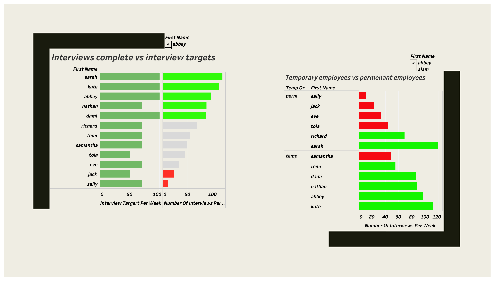

#  *Welcome to Genesis Kiah's homepage. I'm a data analysis and data visualisation specialist*
 Hi, My name is Genesis one intresting fact about me is the meaning of my name, it means the beginning, origin or mode of formation of something! 

I began my self taught journey into data analytics july 2022, and since then i have taken 2 courses The introduction into data and SQL with code first girls and google data analytica course. i have also gone on to create various visulizations alongside this work. I am skilled for most data-science steps data pre-processing, application of statistical methods, data visualization and results communication.

# [project 1: company database](https://github.com/Genesiskiah/company-)

This is the dataset i created whilst undertaking the introduction to data and SQL course with code first girls 

* in this dataset i created a company database 
* i input information about the company database 
* i used functions such as joins, stored procedures and 

## Data visualisation 
 

