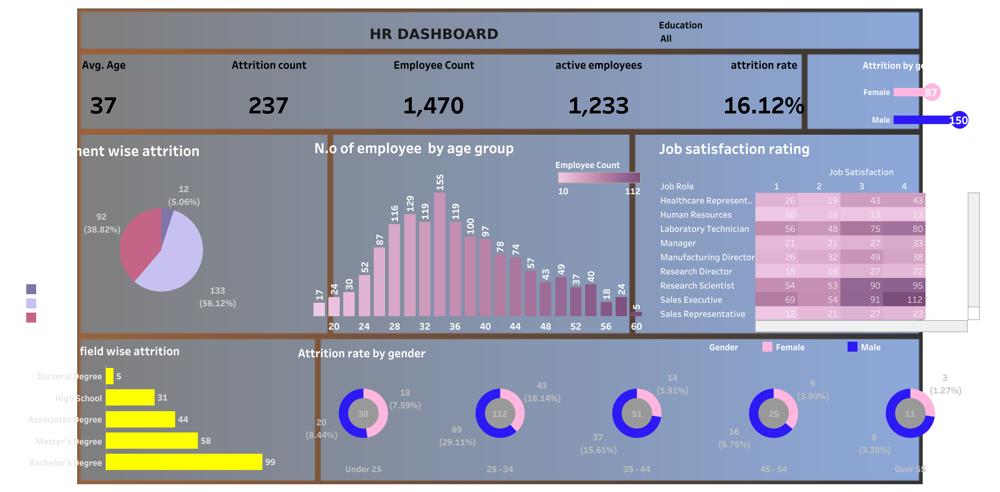

#  *Welcome to Genesis Kiah's homepage. I'm a data analysis and data visualisation specialist*
 Hi, My name is Genesis one intresting fact about me is the meaning of my name, it means the beginning, origin or mode of formation of something! 

I began my self taught journey into data analytics july 2022, and since then i have taken 2 courses The introduction into data and SQL with code first girls and google data analytica course. i have also gone on to create various visulizations alongside this work. I am skilled for most data-science steps data pre-processing, application of statistical methods, data visualization and results communication.

# [project 1: company database](https://github.com/Genesiskiah/company-)

This is the dataset i created whilst undertaking the introduction to data and SQL course with code first girls, i created a database for a recruitment company which contaings information focusing on the recruitment sector of the buisness, it was made to see how much interviews are being conducted by team members who are on a mixture of temporary and permenant contracts to see if the buisness targets are being met. 

* In this dataset i created a company database 
* I input information about the company database 
* I used functions such as joins, stored procedures and views to answer buisness questions 

## Data visualisation 
 

In this visulisation i used the **'Interviews complete vs interview targets'** barchart to showcase which team members were reaching there targets by indicatinig that with the green barchart on the visulization, i then used the grey barcharts to indicate which team members were not hitting there target however completing the minimum amount of interviews per week which was 50 interviews per week. and lastly the red is a indication of the people on the team who arem not reaching there targert along with not meeting the minumum weekly interview target. 

in the second barchart **'Temporary employees vs permenant employees'** i showed which candidates were permenant and which candidates were temporary which in turn showed the temporary candidates are performing better than those with a permenant place on the team. in. this visulisation it showcases everyone who is meeting there target and those who are not. 

## Data visulisations 

***Here you can browse at the other data visulisations i have created***

